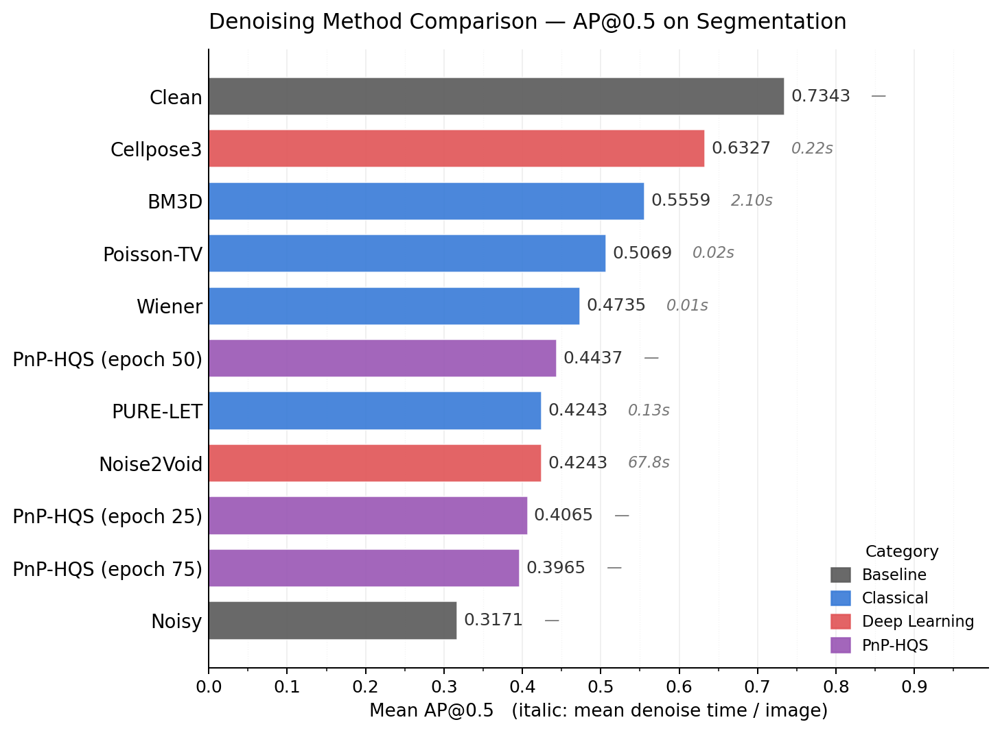

# Denoising Methods in Fluorescence Microscopy (ECE 556)

- Benchmarks classical image denoising (Wiener, Poisson-TV, BM3D, PURE-LET) against Cellpose3 and self-supervised baselines on fluorescence microscopy data
- Evaluates denoising quality via downstream **instance segmentation** (AP@0.5) using the frozen Cellpose `cyto2` model
- Central question: how much of Cellpose3's advantage comes from task-specific learned restoration vs. what established model-based approaches already achieve?

## Setup

### Option A: pip only

```bash
pip install -r requirements.txt
```

### Option B: conda/mamba + pip (I use mamba personally, but pip should be simpler)

```bash
mamba create -n 556Proj python=3.10 -y
mamba activate 556Proj
mamba install numpy scipy scikit-image matplotlib seaborn pandas tifffile imageio -c conda-forge -y
pip install torch torchvision cellpose bm3d
```

---

## Dataset

Go to https://www.cellpose.org/dataset and download the following:

| Zip | Contents | Purpose |
|-----|----------|---------|
| `test.zip` | 68 images + masks | **Required** — main evaluation set |
| `cyto2` (181 MB) | 256 images + masks | Optional — used for hyperparameter tuning (Extensions) |

> `train.zip` is not needed.

Extract and place the files into:
```
data/raw/
  test/    ← contents of test.zip (NNN_img.png + NNN_masks.png pairs)
  cyto2/   ← contents of cyto2 zip (optional)
```

Then run the data preparation script:
```bash
python src/data_prep/data_prep.py                        # generate both noise types (default)
python src/data_prep/data_prep.py --noise_mode poisson   # Poisson-only (sufficient for most work)
python src/data_prep/data_prep.py --noise_mode cellpose3 # cellpose3 noise only
```

This produces:

| Directory | Format | Description |
|-----------|--------|-------------|
| `data/clean/` | `.npy` float32 (H, W, 3) | Original images (uint8 / 255) |
| `data/clean_normed/` | `.npy` float32 (H, W, 3) | Percentile-normalized clean (reference for residual analysis) |
| `data/noisy/poisson/` | `.npy` float32 (H, W, 3) | **Poisson-only noise** — primary input for all denoising methods |
| `data/noisy/cellpose3/` | `.npy` float32 (H, W, 3) | Cellpose3 noise (blur+downsample+Poisson) — optional comparison |
| `data/masks/` | `.npy` uint16 (H, W) | Ground-truth instance segmentation masks (0 = background) |
| `data/noise_params.csv` | CSV | Per-image pscale values (needed by classical filters) |

**Channel convention** (all images): ch0 = Red = nucleus, ch1 = Green = cytoplasm, ch2 = Blue = empty.

Loading in Python:
```python
import numpy as np
noisy = np.load("data/noisy/poisson/000.npy")  # float32 (H, W, 3) — input for denoising
clean = np.load("data/clean_normed/000.npy")   # float32 (H, W, 3) — clean reference
mask  = np.load("data/masks/000.npy")          # uint16  (H, W)    — ground truth
```

To recover integer Poisson counts for classical filters (Anscombe VST, etc.):
```python
import csv
with open("data/noise_params.csv") as f:
    pscale = {r["image"]: float(r["pscale"]) for r in csv.DictReader(f)}
counts = noisy * pscale["000"]  # non-negative integers
```

---

## Pipeline: Denoise → Segment → Evaluate

All methods follow the same pipeline so AP@0.5 scores are directly comparable:

```
data/noisy/poisson/  →  denoise  →  results/denoised/{method}/
                                            │
                                            ▼
                                     segment.py  →  results/pred_masks/{method}/
                                                            │
                                                            ▼
                                                     evaluate.py  →  AP@0.5
```

After saving denoised images to `results/denoised/<method>/`:

```bash
# Segment denoised images with frozen cyto2 model
python src/pipeline/segment.py \
    --input_dir results/denoised/wiener \
    --output_dir results/pred_masks/wiener

# Compute AP@0.5 against ground truth
python src/pipeline/evaluate.py \
    --pred_dir results/pred_masks/wiener \
    --method_name wiener

# Or evaluate all methods at once
python src/pipeline/evaluate.py \
    --pred_dir results/pred_masks \
    --all
```

To establish baselines (clean ceiling, noisy floor):
```bash
# Clean ceiling
python src/pipeline/segment.py --input_dir data/clean --output_dir results/pred_masks/clean
python src/pipeline/evaluate.py --pred_dir results/pred_masks/clean --method_name clean

# Noisy floor
python src/pipeline/segment.py --input_dir data/noisy/poisson --output_dir results/pred_masks/noisy
python src/pipeline/evaluate.py --pred_dir results/pred_masks/noisy --method_name noisy
```

---

## File Structure Overview

**Data preparation** — `src/data_prep/`
- `data_prep.py` — Generate clean/noisy/masks `.npy` from raw PNGs (Poisson and cellpose3 noise variants); logs per-image `pscale` to CSV.
- `data_prep_train.py` — Generate VST-domain (noisy, clean) training pairs from the cyto2 set for the learned PnP denoiser (Extension 2).
- `visualize_data_prep.py` — Sanity-check plots of the generated noise and baseline AP scores.

**Shared utilities** — `src/`
- `vst_math.py` — Anscombe forward + exact-unbiased inverse VST; imported by `denoise_bm3d_vst`, `data_prep_train`, and `pnp_solver`.

**Classical denoisers** — `src/denoisers/classical/`
- `denoise_wiener_vst.py` — VST + local Wiener filter.
- `denoise_bm3d_vst.py` — VST + BM3D.
- `denoise_poisson_tv.py` — VST + ROF-TV (Chambolle).
- `denoise_purelet_swt.py` — PURE-LET via stationary wavelet transform (Poisson-aware, interscale thresholding).

**Learned denoisers** — `src/denoisers/learned/`
- `cellpose3_denoise.py` — Cellpose3 self-supervised baseline (`denoise_cyto3` weights).
- `noise2void.py` — Noise2Void blind self-supervised per-image baseline.
- `cellpose_trainer.py` — Fine-tune a single-channel Cellpose `DenoiseModel` on VST-domain pairs (Extension 2 training).
- `pnp_solver.py` — Plug-and-Play HQS solver; alternates a VST-domain Wiener data step with the learned denoiser prior.

**Pipeline** — `src/pipeline/`
- `segment.py` — Segment `.npy` images with the frozen Cellpose `cyto2` model (`channels=[2, 1]`).
- `evaluate.py` — Compute per-image AP@0.5 (and AP at IoU 0.5–0.95) against ground-truth masks.
- `pipeline_main.py` — End-to-end denoise → segment → evaluate driver for PnP-HQS (Extension 2).
- `task_aware_tuning.py` — Grid-search classical denoiser hyperparameters to maximize AP@0.5 on a held-out validation split (Extension 1).

**Analysis** — `src/analysis/`
- `bootstrap_ci.py` — Paired bootstrap 95% CI and one-sided p-value for ΔAP@0.5 between methods.
- `freq_residual_analysis.py` — Radial PSD, 2D spectrum, and band-power analysis of (denoised − clean) residuals.
- `scatter_delta_plots.py` — Per-image method-vs-baseline scatter and sorted ΔAP@0.5 bar plots.
- `plot_ap_comparison.py`, `plot_tuned_comparison.py`, `boxplot_ap_distributions.py` — Bar/box summaries of mean or per-image AP@0.5 across methods (reads `results/ap_scores/`).
- `time_denoisers.py` — Per-image runtime benchmark across all implemented denoisers.

---

## Classical Denoisers 

These two baselines apply **Anscombe VST** to convert Poisson counts into an approximately Gaussian (unit-variance) domain, run a Gaussian-assumption denoiser, then apply a **numerically-safe inverse VST** back to the original intensity range.

**Channel convention:** ch0 = Red (nucleus), ch1 = Green (cytoplasm), ch2 = Blue (empty).  
**Policy:** denoise Red/Green only; keep Blue unchanged to avoid degeneracies on an (almost) constant channel.

### 1) Poisson-TV (VST + ROF-TV via Chambolle)

- Script: `src/denoisers/classical/denoise_poisson_tv.py`
- Idea: in VST domain, solve a TV-regularized denoising problem (edge-preserving smoothing).
- Dependency: `scikit-image` (for `denoise_tv_chambolle`)

Run:
```bash
# Denoise (Poisson-only noise)
python src/denoisers/classical/denoise_poisson_tv.py --weight 0.10 --n_iter 200
```

Notes:

* --weight controls smoothness strength in the VST domain (larger = smoother).
* Implementation normalizes each channel to [0,1] inside the VST domain for stability, then maps back.


### 2) Wiener filter (VST + local Wiener smoothing)

* Script: src/denoisers/classical/denoise_wiener_vst.py
* Idea: local adaptive smoothing using neighborhood statistics (fast classical baseline).
* Dependency: scipy (for Wiener filtering)
```bash
# Denoise (Poisson-only noise)
python src/denoisers/classical/denoise_wiener_vst.py --mysize 5

# Segment + evaluate (frozen cyto2)
python src/pipeline/segment.py --input_dir results/denoised/wiener --output_dir results/pred_masks/wiener --no_gpu
python src/pipeline/evaluate.py --pred_dir results/pred_masks/wiener --method_name wiener
```
Notes:

* --mysize is the square window size (odd integer). Smaller windows preserve edges more but denoise less.
* Same safe inverse VST + clipping is applied to guarantee finite outputs in [0,1].


### 3) PURE-LET (VST + SWT + Stein's Unbiased Risk Estimator)

- Script: `src/denoisers/classical/denoise_purelet_swt.py`
- Idea: decomposes each channel with an undecimated (shift-invariant) SWT, then analytically solves for the optimal linear combination of threshold basis functions using Stein's unbiased Poisson risk estimate — no manual threshold tuning needed.
- Dependency: `pywt` (PyWavelets)

Run:
```bash
# Denoise (Poisson-only noise)
python src/denoisers/classical/denoise_purelet_swt.py --wavelet sym4 --n_levels 4

# Segment + evaluate (frozen cyto2)
python src/pipeline/segment.py --input_dir results/denoised/purelet_swt --output_dir results/pred_masks/purelet_swt --no_gpu
python src/pipeline/evaluate.py --pred_dir results/pred_masks/purelet_swt --method_name purelet_swt
```

Notes:

* `--wavelet` sets the mother wavelet (default `sym4`; `db4` and `bior2.2` are reasonable alternatives).
* `--n_levels` controls the decomposition depth (default 4). More levels capture lower-frequency structure but increase runtime.
* SWT avoids the ringing and shift-sensitivity artifacts of standard DWT; no cycle-spinning is needed.


## Segment + evaluate (frozen cyto2)
python src/pipeline/segment.py --input_dir results/denoised/poisson_tv --output_dir results/pred_masks/poisson_tv --no_gpu
python src/pipeline/evaluate.py --pred_dir results/pred_masks/poisson_tv --method_name poisson_tv

## Extension 1: Task-Aware Hyperparameter Tuning
Classical denoisers ship with hyperparameters tuned for pixel fidelity (PSNR).
Extension 1 instead grid-searches each classical denoiser's main parameter to
maximize downstream **AP@0.5** on a held-out 15-image validation subset, then
re-evaluates the selected settings on all 68 test images.

Grids:
- Poisson-TV: `weight` (log-spaced around the default 0.10, `n_iter=200`)
- BM3D: `sigma_vst` (multipliers around 1.0)
- Wiener: `mysize` (odd window sizes around 5)

### Grid search + final evaluation

```bash
# Full pipeline: grid search on validation -> denoise/segment/eval on all 68
python src/pipeline/task_aware_tuning.py

# Grid search only (skip the 68-image re-evaluation step)
python src/pipeline/task_aware_tuning.py --grid-only

# Skip grid search and re-evaluate with specific picks
python src/pipeline/task_aware_tuning.py --skip-grid \
    --tv-weight 0.06 --bm3d-sigma 0.8 --wiener-size 7
```

Outputs land under `results/extension1/`: validation split CSV, per-grid-point
AP scores, the chosen hyperparameters, tuned denoised images, tuned prediction
masks, and a `tuned_summary.csv` comparison. The tuned-vs-default bar chart is
produced by `src/analysis/plot_tuned_comparison.py`.

## Extension 2: Learned PnP Denoiser
Extension 2 replaces BM3D's hand-crafted prior with a neural denoiser trained
in the Anscombe VST domain and plugged into the same HQS framework.

### Training

```bash
# 1. Generate VST-domain training pairs from the cyto2 training set
python src/data_prep/data_prep_train.py

# 2. Train the denoiser (checkpoints saved every 25 epochs)
python src/denoisers/learned/cellpose_trainer.py --n_epochs 100
```

### Inference and evaluation

```bash
# Denoise + segment all 68 test images with the epoch-75 checkpoint
python src/pipeline/pipeline_main.py \
    --denoiser_path models/pnp_denoiser/cellpose_vst_denoiser_epoch75.pth \
    --metrics_csv results/ap_scores/pnp_hqs_epoch75.csv

# Compare against other methods via bootstrap CI
python src/analysis/bootstrap_ci.py --baseline noisy --method pnp_hqs_epoch75 bm3d purelet
python src/analysis/scatter_delta_plots.py --methods pnp_hqs_epoch75 bm3d purelet cellpose3
```

---

## Results

AP@0.5 across methods (frozen Cellpose `cyto2` segmentation on all 68 test
images), including the learned PnP-HQS denoiser:


